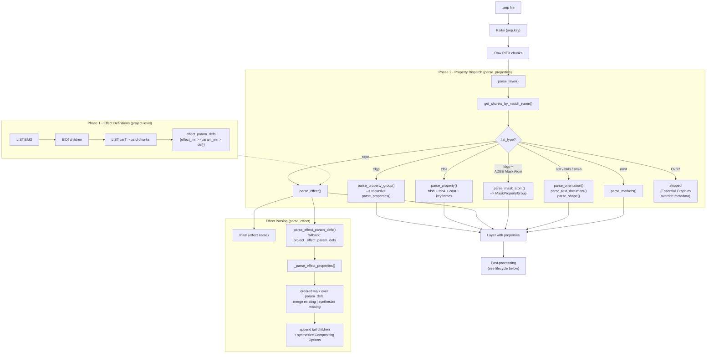
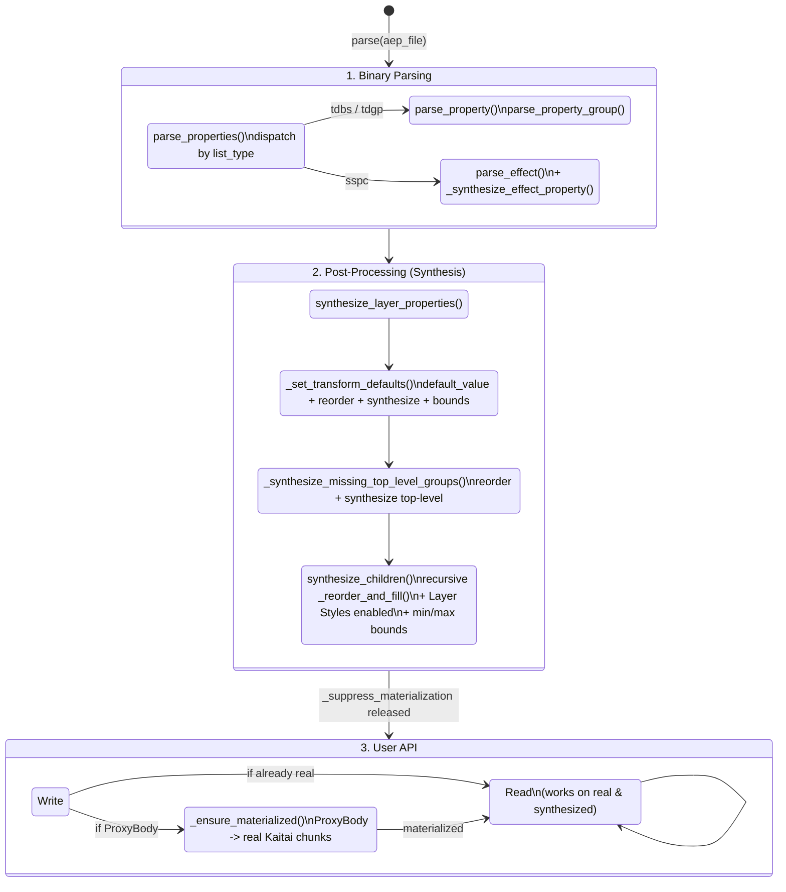

# Contributing Guide

This guide helps you understand the py_aep codebase and contribute new features, fixes, and improvements.

## Quick Start

1. **Fork and clone** the repository
2. **Install with dev dependencies**:
   - With uv (recommended): `uv sync --extra dev`
   - With pip: `pip install -e ".[dev]"`
3. **Run tests**: `uv run pytest` (or `pytest`)
4. **Make your changes** following this guide
5. **Submit a pull request**

## Understanding the Codebase

### Architecture Overview

py_aep transforms binary .aep files into typed Python objects through a three-stage pipeline:

```
.aep file > Kaitai Parser > Raw Chunks > Parsers > Model Classes
```

**Stage 1: Binary Parsing (Kaitai)**
- `src/py_aep/kaitai/aep.ksy` - Schema defining RIFX chunk structure
- `src/py_aep/kaitai/aep.py` - Auto-generated Python parser (don't edit manually)
- `src/py_aep/kaitai/utils.py` - Helper functions for navigating chunks
- `src/py_aep/kaitai/descriptors.py` - ChunkField descriptor for write-through to binary
- `src/py_aep/kaitai/patches.py` - Monkey-patches on auto-generated Kaitai body classes (e.g. `_recompute_size` for variable-size bodies used by `propagate_check`)

**Stage 2: Data Transformation (Parsers)**
- `src/py_aep/parsers/` - Locate chunks and pass chunk bodies to model constructors
- Entry point: `parse()` in `__init__.py`
- Pattern: Each parser receives chunks + context, passes `chunk.body` to the model

**Stage 3: Data Models**
- `src/py_aep/models/` - Classes using ChunkField descriptors, mirroring AE's object model
- `items/` - CompItem, FootageItem, FolderItem
- `layers/` - Layer types (AVLayer, TextLayer, ShapeLayer, etc.)
- `properties/` - Effects and animation (Property, PropertyGroup, Keyframe, MarkerValue)
- `sources/` - Footage sources (FileSource, SolidSource, PlaceholderSource)
- `renderqueue/` - Render queue (RenderQueueItem, OutputModule, SettingsView)
- `text/` - TextDocument and FontObject (COS-dict-backed via CosField descriptors)

**Supporting Modules**
- `src/py_aep/enums/` - Enumerations matching ExtendScript values
- `src/py_aep/resolvers/` - Business logic for computing derived values
- `src/py_aep/cos/` - COS (PDF-like) format parser for embedded text data
- `src/py_aep/validators.py` - Field validators for model attributes
- `src/py_aep/reverses.py` - Generic reverse transform factories
- `src/py_aep/transforms.py` - Generic forward transform factories

### Key Concepts

**Chunks**: AEP files use the RIFX format (big-endian RIFF). The file is a tree of "chunks" identified by 4-character types (e.g., `"cdta"`, `"ldta"`).

**LIST chunks**: Special chunks that contain other chunks. They have a `list_type` field (e.g., `"Layr"` for layers).

**Chunk data access**: Chunk attributes live on `chunk.body`, not on the chunk itself:
```python
chunk.body.list_type     # the list_type of a LIST chunk
cdta_chunk.body.time_scale  # a typed body field
```

**Chunk navigation**: Use helper functions from `kaitai/utils.py`:
```python
from py_aep.kaitai.utils import find_by_type, find_by_list_type, filter_by_type

data_chunk = find_by_type(chunks=child_chunks, chunk_type="cdta")
comp_chunk = find_by_list_type(chunks=root_chunks, list_type="Comp")
layer_chunks = filter_by_list_type(chunks=comp_chunks, list_type="Layr")
```

**Typed LIST instances**: Some LIST types have children at fixed positions. `list_body` in `aep.ksy` defines instances for direct access:
```python
# LIST:tdbs - leaf property container
tdbs_chunk.body.tdsb   # chunks[0] - property flags
tdbs_chunk.body.tdsn   # chunks[1] - property name
tdbs_chunk.body.tdb4   # chunks[2] - property metadata
```

Each instance has an `if` guard on `list_type`, so accessing e.g. `.tdsb` on a non-`tdbs` LIST returns `None`. Use `find_by_type` when the LIST type is unknown or when a function handles multiple LIST types.

**ChunkField descriptors**: Model attributes backed by Kaitai chunk bodies. Reads and writes pass through to the binary:
```python
class CompItem(AVItem):
    frame_rate = ChunkField[float](
        "_cdta", "frame_rate",
        transform=..., reverse_instance_field=...,
    )
    """The frame rate of the composition. Read / Write."""
```

When a user writes `comp.frame_rate = 30.0`, the descriptor converts the value back to binary representation and writes it to the underlying chunk body.

**Serialization roundtrip**: `parse()` then `save()` must produce byte-identical output. Parsers must not mutate Kaitai chunk data. ChunkField descriptors use `reverse_seq_field` (scalar) or `reverse_instance_field` (multi-field) functions to convert user-facing values back to binary format, and `propagate_check` to update parent chunk sizes.

### Property & Effect Parsing Flow

Properties go through three pipeline stages: binary parsing, type dispatch, and post-processing (defaults and synthesis). The diagram below shows the full call chain.

#### Overview



#### Property Synthesis Lifecycle

Every property on a layer goes through a well-defined lifecycle from binary parsing to user-facing API. The diagram below shows every state a property can be in and what triggers transitions between them.

##### State Diagram



The entire parse pipeline runs inside `_suppress_materialization()`, which prevents writes from triggering materialization. After `parse()` returns, the context is released and end-user writes are allowed.

Each property in the tree is in one of two states:

| State | Backing | Created by | Value source | Writable? |
|---|---|---|---|---|
| **Real** | Kaitai `TdsbBody` + `Tdb4Body` + `CdatBody` | `parse_property()`, `parse_property_group()`, `parse_effect()` (existing params) | `cdat` chunk or keyframes | Yes, directly |
| **Synthesized** | `ProxyBody` (lightweight attribute bag) | `Property.synthesized()`, `_synthesize_effect_property()`, `_reorder_and_fill()` (in `models/properties/property_group.py`) | `_PropSpec.value` / `_PropSpec.default_value` / effect param def | Yes, triggers materialization on first write |

##### Lifecycle Phases in Detail

**Phase 1 - Binary parsing**: Dispatch by `list_type` is shown in the overview flowchart above. Most dispatch targets produce properties with real Kaitai chunk backing. The exception is `parse_effect()` (sspc), which produces a mix: existing params get real backing, missing params are synthesized with `ProxyBody` via `_synthesize_effect_property()`.

**Phase 2 - Post-processing** (single pass in `parsers/synthesis.py`):

After `parse_properties` returns, `parse_layer` calls `synthesize_layer_properties(layer)` - the single entry point for all static property enrichment. All writes during this phase use `ProxyBody` and bypass materialization (the `_suppress_materialization` context is active).

```
parse_layer()
  |
  +-- synthesize_layer_properties(layer)     # parsers/synthesis.py
        |
        +-- _set_transform_defaults(layer)            # Site 1: Transform
        |     Phase 1: set default_value on parsed transform properties
        |     Phase 2: _reorder_and_fill() with _TRANSFORM_SPECS
        |              - synthesizes missing transform properties (up to 12)
        |              - reorders to canonical ExtendScript order
        |     Phase 3: context-dependent naming (2D/3D, Camera/Light)
        |     Phase 4: apply min/max bounds on transform leaf properties
        |
        +-- _synthesize_missing_top_level_groups()    # Site 2: Top-level groups
        |     _reorder_and_fill() with _TOP_LEVEL_SPECS
        |     - synthesizes missing groups (up to 17 for AVLayer)
        |     - skips groups irrelevant to layer type (text-only, shape-only)
        |     - reorders to canonical ExtendScript order
        |
        +-- for each top-level PropertyGroup:         # Site 3: Sub-properties
              synthesize_children(group)
                _reorder_and_fill() with _GROUP_CHILD_SPECS
                - synthesizes missing children for known groups
                - special handling for Layer Styles sub-groups
                - derives collapsed enabled state for Layer Styles
                  and mirrors it onto Blend Options
                - applies _PROPERTY_MIN_MAX bounds to leaf children
                - recurses into PropertyGroup children
```

Effect parameter synthesis (Site 4) remains a separate dynamic step inside `parse_effect()` > `_parse_effect_properties()` during Phase 1, because it relies on binary parT/pard data rather than static spec tables. See the effect parameter definitions section below.

**Phase 3 - User API** (materialization on write):

After `parse()` returns, `_suppress_materialization` is released and the property tree is ready for use. Properties with real Kaitai backing are directly readable and writable. Synthesized properties (`ProxyBody` backing) are readable immediately - writes trigger materialization:

```
user writes comp.layers[0].transform.opacity.value = 50
  |
  +-- ChunkField.__set__() on Property
  |     calls obj._ensure_materialized()
  |
  +-- Property._ensure_materialized()
  |     if _tdsb is ProxyBody:
  |       parent._ensure_materialized()     # recursive: ensure parent group exists
  |       materialize_property(parent._tdgp, ...)
  |       replace _tdsb, _tdb4, _tdbs, _name_utf8, _cdat with real chunks
  |     else: no-op (already real)
  |
  +-- ChunkField writes value to real chunk body
  +-- propagate_check() updates parent chunk sizes
```

After materialization the property is indistinguishable from one parsed from binary. The `ProxyBody` instances are discarded and all subsequent reads and writes go through real Kaitai chunk bodies.

##### Materialization Trigger Convention

Materialization is triggered explicitly:

- **`ChunkField.__set__`** calls `obj._ensure_materialized()` automatically.
- **`@property` setters** must call `self._ensure_materialized()` as their first statement.

When adding a new writable `@property` on `PropertyBase`, `Property`, or `PropertyGroup`, add `self._ensure_materialized()` as the first line of the setter.

##### _reorder_and_fill - The Core Synthesis Primitive

All static synthesis sites delegate to `_reorder_and_fill()` (in `models/properties/property_group.py`). This function takes a container (layer or group), a list of canonical specs, and:

1. **Preserves** existing children: moves them to canonical position, updates metadata (`_auto_name`, `color`, `min_value`, `max_value`, `default_value`, `can_vary_over_time`)
2. **Synthesizes** missing children: creates `Property.synthesized()` (for `_PropSpec`) or empty `PropertyGroup` (for `_GroupSpec`) with `ProxyBody` backing
3. **Skips** match names in the `skip` set (layer-type filtering)
4. **Appends** non-spec children at the end, controlled by `tail_mode`:
   - `"none"` - drop non-spec children (transform)
   - `"groups"` - keep only `PropertyGroup` children (default)
   - `"all"` - keep everything (top-level groups)

#### Key Spec Tables (in `models/properties/specs.py`)

- **`_PropSpec`** - Metadata for synthesizing a leaf `Property` (match_name, name, value, type, dimensions, spatial, color, min/max, default_value, can_vary_over_time)
- **`_GroupSpec`** - Metadata for synthesizing an empty `PropertyGroup` (match_name, name)
- **`_GROUP_CHILD_SPECS`** - Maps group match_name to ordered child specs (Material Options, Camera, Light, Masks, Blend Options, Vector shapes, etc.)
- **`_LAYER_STYLE_CHILD_SPECS`** - Maps Layer Style sub-group match_name to child specs (Drop Shadow, Inner Glow, etc.)
- **`_TRANSFORM_SPECS`** / **`_TRANSFORM_FIXED_DEFAULTS`** - Transform property canonical order and fixed defaults
- **`_TOP_LEVEL_SPECS`** - Canonical order and specs of top-level property groups on a layer

#### Effect Parameter Definitions

Effects use a two-level param def system:

1. **Project-level** (`LIST:EfdG`): Parsed once during `parse_project_item()` into `project._effect_param_defs`. Contains canonical parameter names, types, defaults, and min/max.
2. **Layer-level** (`LIST:parT` inside `LIST:sspc`): Parsed per effect instance. Overrides project-level if present.

During `_parse_effect_properties()`:
- A single ordered walk over `param_defs` handles both cases: existing binary properties are enriched via `_merge_param_def()`, while missing parameters are synthesized via `_synthesize_effect_property()` (creates `Property` with `ProxyBody`). Children come out in canonical `parT` order without a separate sort.
- Tail children not in `param_defs` (e.g. `ADBE Effect Built In Params`) are appended in their original parsed order.
- If `ADBE Effect Built In Params` (Compositing Options) is absent from the binary, it is synthesized as an empty `PropertyGroup` so that `synthesize_children()` can fill it from `_COMPOSITING_OPTIONS_SPECS` during post-processing.

#### Chunk Types Reference

| Chunk | Role |
|---|---|
| `tdmn` | Match name identifier (links property to its spec) |
| `LIST:tdgp` | PropertyGroup container |
| `LIST:tdbs` | Leaf Property container (fixed children: tdsb, tdsn, tdb4) |
| `tdsb` | Property flags (enabled, locked_ratio, roto_bezier, dimensions_separated) |
| `tdsn` | Property display name |
| `tdb4` | Property metadata (dimensions, is_spatial, color, can_vary_over_time, ...) |
| `cdat` | Property static value data |
| `LIST:list` | Keyframe container (lhd3 header + ldat items) |
| `LIST:sspc` | Effect container (fnam + tdgp + parT) |
| `LIST:parT` / `pard` | Effect parameter definitions |
| `LIST:EfdG` / `EfDf` | Project-level cached effect definitions |
| `LIST:om-s` | Shape/mask path data |
| `LIST:otst` | Orientation property |
| `LIST:btds` | Text document property (COS format) |
| `LIST:mrst` | Marker property container |
| `LIST:OvG2` | Essential Graphics override metadata (skipped) |

## Development Workflow

### Setting Up Your Environment

```bash
# Clone the repository
git clone https://github.com/forticheprod/py-aep.git
cd py-aep

# Install with dev dependencies (pick one)
uv sync --extra dev    # recommended
pip install -e ".[dev]" # alternative

# Verify installation
uv run pytest
```

### Running Checks

```bash
# Run all tests (parallel)
uv run pytest

# Run with coverage
uv run pytest --cov=src/py_aep --cov-report html --cov-report term:skip-covered

# Type checking
uv run mypy src/py_aep

# Linting and formatting
uv run ruff check src/ tests/ ; uv run ruff format src/ tests/
```

### CLI Tools

#### aep-validate

Compare parsed output against ExtendScript JSON. **Use after any parsing change.**

```bash
# Basic validation
aep-validate sample.aep sample.json

# All field comparisons
aep-validate sample.aep sample.json --verbose

# Filter by category
aep-validate sample.aep sample.json --category layers
```

#### aep-compare

Compare AEP files to find byte-level differences. **Use to investigate unknown fields.**

```bash
# Two-file comparison
aep-compare file1.aep file2.aep

# Multi-file comparison against a reference
aep-compare ref.aep v1.aep v2.aep v3.aep

# List all chunks in a file
aep-compare file.aep --list

# Dump raw bytes of a specific chunk path
aep-compare file.aep --dump "LIST:Fold/ftts"
```

#### aep-visualize

Visualize the parsed project structure:

```bash
aep-visualize project.aep
aep-visualize project.aep --depth 2
aep-visualize project.aep --no-properties
```

#### After Effects JSX Scripts

Located in `scripts/jsx/`, these scripts help generate test samples and validation data:

**export_project_json.jsx**: Export AE project to JSON for testing. Open After Effects, open your .aep file, then File > Scripts > Run Script File. The resulting `.json` file serves as ground truth for `aep-validate`.

**generate_model_samples.jsx**: Generate comprehensive test samples covering many attributes. Used by the test suite.

### Debugging Tips

**Finding chunk types**: Use `aep-visualize` to see the parsed project structure.

**Comparing files**: To understand what bytes change when you modify an attribute:
1. Create a minimal .aep file and save it
2. Change ONE attribute in After Effects and save as a different file
3. Compare: `aep-compare before.aep after.aep`

**Using the Kaitai Web IDE**: The [Kaitai Struct Web IDE](https://ide.kaitai.io/) lets you upload `aep.ksy` and a .aep file to browse the parsed structure interactively.

**Using Python REPL**:
```python
from py_aep import parse

app = parse("samples/models/composition/bgColor_custom.aep")
comp = app.project.compositions[0]
print(comp.frame_rate)
```

## Adding New Features

### Adding a New Attribute

#### 1. Identify the Data Location

Use `aep-compare` to find where the attribute is stored:

```bash
# Create two files that differ only in the target attribute
aep-compare without_attr.aep with_attr.aep
```

Note the chunk type and byte position.

#### 2. Update Kaitai Schema (if needed)

If the chunk or field isn't already parsed, add it to `aep.ksy`:

```yaml
- id: data
  type:
    switch-on: chunk_type
    cases:
      '"cdta"': chunk_cdta
      '"xxxx"': chunk_xxxx  # Add new chunk type
```

Then regenerate:

```bash
kaitai-struct-compiler --target python \
  --outdir src/py_aep/kaitai \
  src/py_aep/kaitai/aep.ksy \
  --read-write --no-auto-read
```

> **Integer division pitfall:** In Kaitai Struct, `/` between two integers
> compiles to Python's `//` (floor division). To get true (float) division,
> multiply one operand by `1.0`:
> ```yaml
> # Wrong - truncates to integer
> value: 'pixel_ratio_dividend / pixel_ratio_divisor'
> # Correct - produces float
> value: 'pixel_ratio_dividend * 1.0 / pixel_ratio_divisor'
> ```

#### 3. Update the Model

Add the attribute as a **ChunkField descriptor** on the model class. Use inline docstrings after each field:

```python
class CompItem(AVItem):
    """Composition item containing layers."""

    shutter_angle = ChunkField[int](
        "_cdta", "shutter_angle",
    )
    """
    The shutter angle setting for the composition. This corresponds to the
    Shutter Angle setting in the Advanced tab of the Composition Settings
    dialog box. Read / Write.
    """
```

For read-only fields, set `read_only=True`:

```python
    duration = ChunkField[float](
        "_cdta", "duration",
        transform=...,
        read_only=True,
    )
    """The total duration of the composition, in seconds. Read-only."""
```

**Descriptor types:**

| Pattern | When to use |
|---------|-------------|
| `ChunkField("_body", "field")` | Direct 1:1 mapping to a `seq:` field |
| `ChunkField.bool("_body", "field")` | Binary integer exposed as `bool` |
| `ChunkField.enum(MyEnum, "_body", "field")` | IntEnum field (auto-detects `from_binary`/`to_binary`) |
| `ChunkField("_body", "inst", reverse_instance_field=fn)` | Kaitai instance backed by multiple `seq:` fields; `fn(value, body)` returns `dict` of source fields |
| `@property` (with optional setter) | Computed from multiple fields or non-chunk data |

**Important**: Always add docstrings referencing the [After Effects Scripting Guide](https://ae-scripting.docsforadobe.dev/). Keep docstring lines under 80 characters. End each docstring with "Read-only." or "Read / Write." as appropriate.

#### 4. Update the Parser

Parsers should be thin chunk-locators: find chunks, pass `chunk.body` to the model constructor. Don't extract individual fields:

```python
def parse_comp_item(child_chunks: list[Aep.Chunk], ...) -> CompItem:
    cdta_chunk = find_by_type(chunks=child_chunks, chunk_type="cdta")

    return CompItem(
        _cdta=cdta_chunk.body,  # Pass the whole chunk body
        # ... other chunk bodies and non-chunk args ...
    )
```

The **constructor parameter ordering** convention is: private chunk bodies (`_`-prefixed) first, then back-references (`project`, `parent_folder`, etc.), then public domain parameters.

#### 5. Add Enum Mappings (if binary values differ from ExtendScript)

Single-parameter binary-to-ExtendScript mappings use a `from_binary` classmethod on the enum:

```python
# In enums/general.py
class BlendingMode(IntEnum):
    ADD = 1
    MULTIPLY = 2
    # ...

    @classmethod
    def from_binary(cls, value: int) -> BlendingMode:
        _MAP = {0: cls.ADD, 1: cls.MULTIPLY, ...}
        return _MAP.get(value, cls.ADD)
```

Multi-parameter mappings go in `enums/mappings.py`:

```python
def map_alpha_mode(value: int, has_alpha: bool) -> AlphaMode:
    ...
```

#### 6. Validate and Test

**Always validate** parsed output against ExtendScript using `aep-validate`:

```bash
aep-validate sample.aep sample.json
```

Create a test in the appropriate test file:

```python
def test_comp_shutter_angle():
    app = parse("samples/models/composition/shutterAngle_180.aep")
    comp = app.project.compositions[0]
    assert comp.shutter_angle == 180.0
```

For writable fields, add a **roundtrip test** following the pattern in `tests/test_models_composition.py`:

```python
class TestRoundtripShutterAngle:
    def test_modify_shutter_angle(self, tmp_path: Path) -> None:
        project = parse_aep(SAMPLES_DIR / "shutterAngle_180.aep").project
        comp = project.compositions[0]
        assert comp.shutter_angle == 180

        comp.shutter_angle = 360
        project.save(tmp_path / "modified.aep")

        project2 = parse_aep(tmp_path / "modified.aep").project
        assert project2.compositions[0].shutter_angle == 360
```

#### 7. Create Test Samples

Use After Effects to create test samples:
- One .aep file per test case, minimal project structure
- Naming: `samples/models/<type>/<attribute>_<value>.aep`
- Run the JSX export script to generate the matching `.json` file

### Adding Boolean Flags (1-bit Attributes)

Boolean flags are stored as individual bits within a byte:

#### 1. Find the Bit Position

```bash
aep-compare test_false.aep test_true.aep
```

Convert byte values to binary to identify the bit:
```
10 (decimal) = 00001010 (binary)
14 (decimal) = 00001110 (binary)
                    ^
                    bit 2 changed
```

#### 2. Update Kaitai Schema

```yaml
# Read individual bits (from MSB to LSB: 7 > 0)
- id: preserve_nested_resolution
  type: b1  # bit 7
- type: b1  # skip bit 6
- id: motion_blur
  type: b1  # bit 5
- type: b5  # skip remaining bits
```

All bits in a byte must be accounted for (sum to 8).

#### 3. Wire to Model

Use `ChunkField.bool`:

```python
motion_blur = ChunkField.bool("_cdta", "motion_blur")
"""When `True`, motion blur is enabled for the composition. Read / Write."""
```

## Testing

### Running Tests

```bash
# Run all tests
uv run pytest

# Run specific test file
uv run pytest tests/test_models_layer.py

# Run specific test
uv run pytest tests/test_models_layer.py::test_layer_motion_blur -v

# Run with coverage
uv run pytest --cov=src/py_aep --cov-report html --cov-report term:skip-covered
```

### Test Structure

Tests are organized by model type:
- `test_models_project.py` - Project-level attributes
- `test_models_composition.py` - CompItem attributes and roundtrip tests
- `test_models_footage.py` - FootageItem and sources
- `test_models_layer.py` - Layer types and attributes
- `test_models_property.py` - Properties, keyframes, effects, roundtrip tests
- `test_models_marker.py` - Markers
- `test_models_text.py` - TextDocument and FontObject roundtrip tests
- `test_models_renderqueue.py` - Render queue, settings, output modules

### Writing Tests

Follow the existing test patterns. Compare with JSON values whenever possible:

```python
def test_attribute_name():
    """Test parsing <attribute> from <object>."""
    app = parse("samples/models/<type>/<attribute>_<value>.aep")
    project = app.project
    comp = project.compositions[0]
    assert comp.attribute_name == expected_value
```

For writable attributes, add roundtrip tests (parse > modify > save > re-parse > assert).

### Creating Test Samples

Test samples should be minimal and focused:
- One .aep file per test case
- Minimal project structure (one comp, one layer if possible)
- Descriptive filename: `<attribute>_<value>.aep`
- Store in `samples/models/<type>/`

## Code Style

### Python Conventions

- **Type hints**: All functions must have type hints (`disallow_untyped_defs = true`)
- **Imports**: Use `from __future__ import annotations` in every file; modern type syntax (`list[int]` not `List[int]`)
- **Conditional imports**: Use `TYPE_CHECKING` to avoid circular imports
- **Naming**: `snake_case` for functions/variables, `PascalCase` for classes
- **Paths**: Use `pathlib` for file paths
- **Docstrings**: Google-style (Args, Returns, Raises sections) for functions; inline docstrings after each field for model classes
- **Cross-references**: Use mkdocstrings syntax `[ClassName][]` or `[text][fully.qualified.path]` to link to other classes in docstrings. Do **not** use Sphinx-style `:class:` / `:func:` notation.
- **No `struct` module**: All binary decoding must be in `kaitai/aep.ksy`
- **No em dashes or en dashes**: Use regular dashes (`-`)

### Linting and Type Checking

```bash
# Check code style and auto-fix
uv run ruff check src/ tests/ ; uv run ruff format src/ tests/

# Type checking
uv run mypy src/py_aep
```

`kaitai/aep.py` is auto-generated and excluded from linting.

## Documentation

### Building Documentation

```bash
# Install docs dependencies
uv sync --extra docs

# Build static site
uv run zensical build --strict

# Serve with live reload
uv run zensical serve --strict
```

Documentation is auto-deployed to GitHub Pages when changes are pushed to `main`.

### Writing Documentation

API docs are auto-generated from docstrings using mkdocstrings. Reference the [After Effects Scripting Guide](https://ae-scripting.docsforadobe.dev/) in docstrings.

Use [scoped cross-references](https://mkdocstrings.github.io/python/usage/configuration/docstrings/#scoped_crossrefs) to link to other classes:

```python
# Short form - resolved via scoped cross-references
"""The [CompItem][] that contains this layer."""

# Explicit path - for cross-module or ambiguous references
"""See [FileSource][py_aep.models.sources.file.FileSource]."""

# Don't use Sphinx-style notation
"""Returns a :class:`CompItem` instance."""  # Wrong
```

## Getting Help

- **Issue tracker**: [GitHub Issues](https://github.com/forticheprod/py-aep/issues)
- **Discussions**: [GitHub Discussions](https://github.com/forticheprod/py-aep/discussions)
- **After Effects Scripting**: [Official Scripting Guide](https://ae-scripting.docsforadobe.dev/)
- **Kaitai Struct**: [Documentation](https://doc.kaitai.io/)
- **Lottie Docs**: [AEP format documentation](https://github.com/hunger-zh/lottie-docs/blob/main/docs/aep.md)
